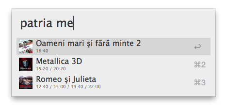

Patria workflow
==

### Description
Alfred 2 workflow to get the movie schedule from [Patria](http://patria.md/movies) website.

### Usage
`patria [optional argument]`

The `optional argument` is used to filter the movie list by title, or by sessions' time.

Each item in the list is active. 
Upon clicking an item, the trailer of the movie (provided on its patria.md page) is opened in a new tab of the default browser.
